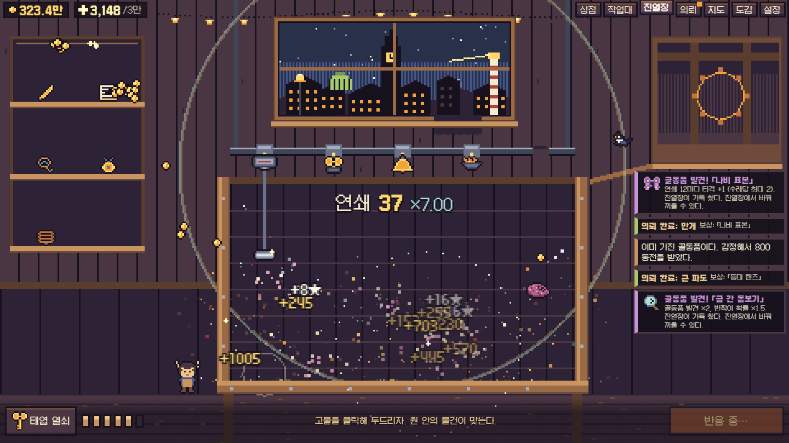
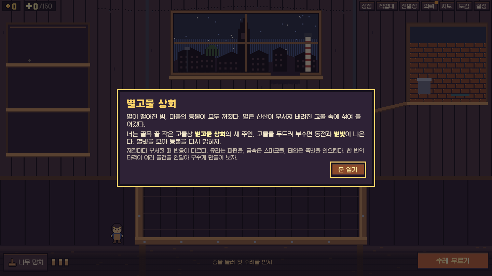
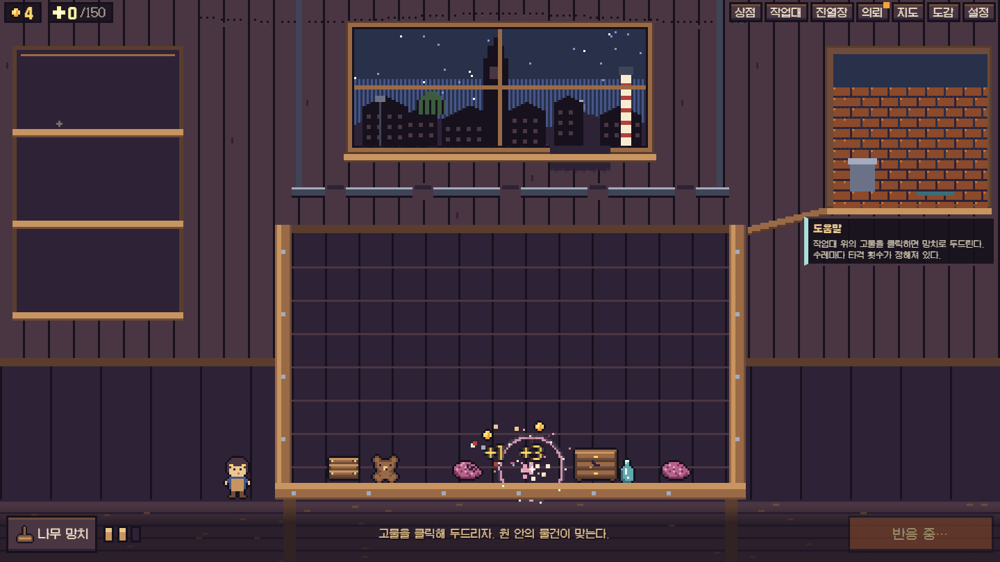
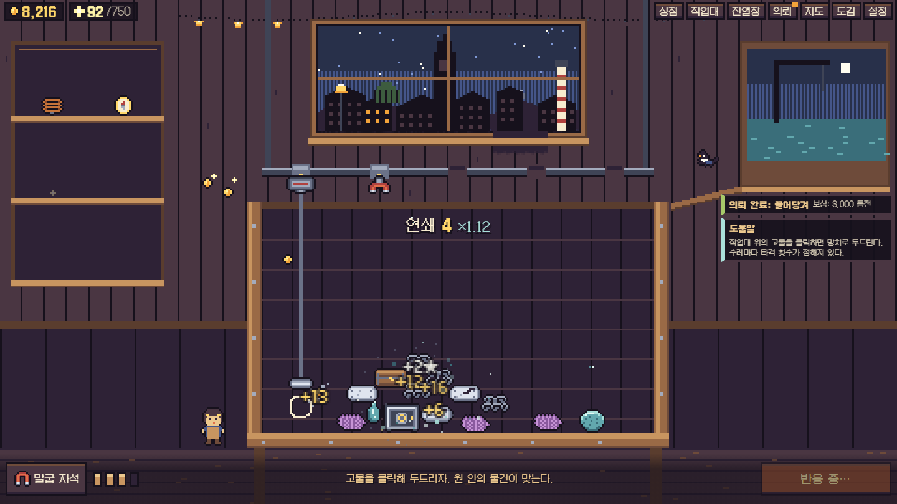
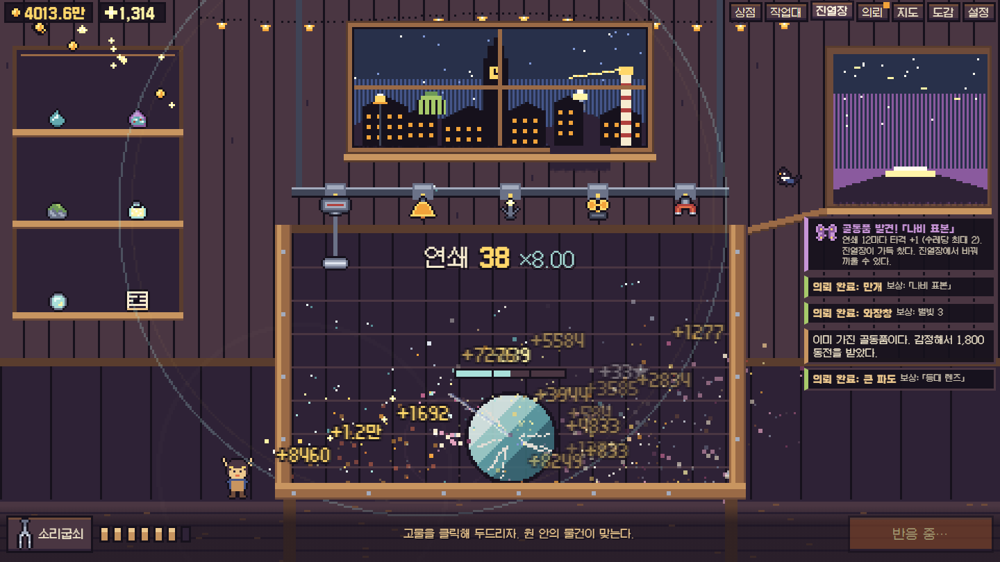
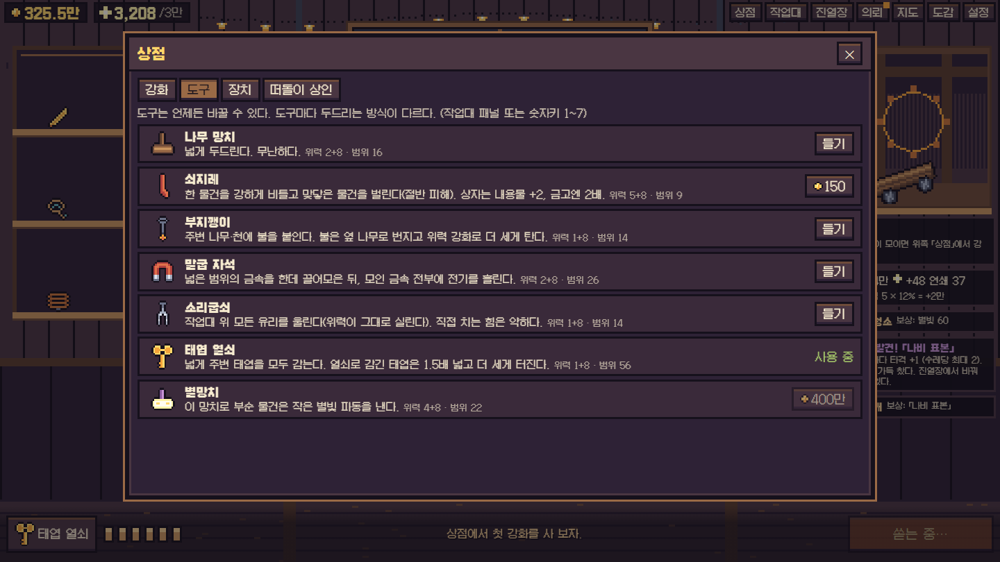
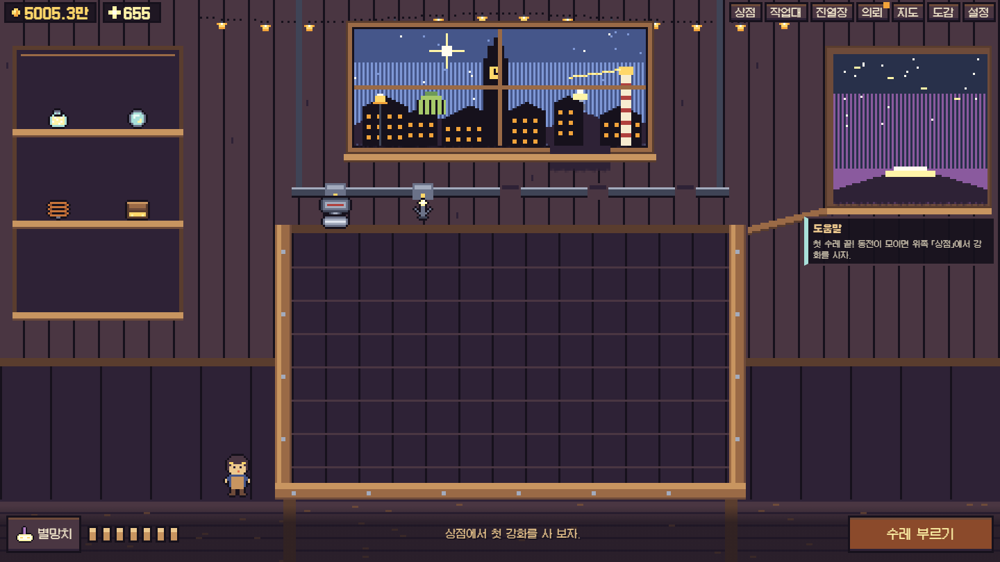

# 별고물 상회 · Junklight Emporium

**▶ 바로 플레이: https://legerdo.github.io/junklight-emporium/**

버려진 고물을 두드려 부수고, 재질마다 다른 반응으로 연쇄를 일으켜 떨어진 별을 되살리는 한국어 2D 픽셀 액티브 인크리멘탈 게임입니다. 마우스 하나로 플레이하며, 첫 엔딩까지 약 60~80분이 걸립니다.



## 어떤 게임인가

별이 떨어진 밤, 마을의 등불이 모두 꺼졌습니다. 부서진 별은 고물 속에 섞여 들어갔고, 당신은 골목 끝 작은 고물상의 새 주인입니다.

수레가 고물을 쏟으면 **정해진 타격 횟수** 안에서 어디를 칠지 고릅니다. 재질마다 부서질 때 반응이 달라서, 한 번의 선택이 작업대 전체로 번집니다.

| 재질 | 부서질 때 |
| --- | --- |
| 나무 | 파편이 닿은 물건을 때린다. 불이 붙는다 |
| 유리 | 유리 파편이 사방으로 튄다 |
| 금속 | 가까운 금속으로 스파크가 튄다 |
| 천 | 먼지를 뿜어 주변을 약하게 만든다. 파편은 막는다 |
| 태엽 | 맞으면 감겨서 잠시 뒤 폭발한다 |
| 별 | 별빛 파동이 퍼진다. 별빛을 준다 |

연쇄가 끊기기 전에 다음 타격을 넣으면 배율이 이어집니다. 연타보다 **어디를, 언제** 치는지가 중요합니다.

## 스크린샷

| | |
| --- | --- |
|  |  |
| 새 주인이 된 첫 밤 | 뒷골목에서 망치로 첫 타격 |
|  |  |
| 고철 부두: 자석으로 금속을 모아 전기를 흘린다 | 별의 심장: 겹마다 약한 반응이 다르다 |
|  |  |
| 도구 7종은 두드리는 방식이 모두 다르다 | 별이 돌아간 뒤 마을의 모든 등불이 켜진다 |

## 성장과 콘텐츠

- **지역 5곳**: 뒷골목 → 고철 부두 → 유리 온실 → 시계탑 다락 → 별 낙하지. 고물 구성과 규칙이 다르고, 별빛으로 등불을 밝히면 창밖 마을이 실제로 켜집니다.
- **도구 7종**: 망치, 쇠지레, 부지깽이, 말굽 자석, 소리굽쇠, 태엽 열쇠, 별망치. 언제든 바꿀 수 있습니다.
- **골동품 28종**: 진열장에 놓으면 규칙이 바뀝니다. 예를 들어 프리즘을 놓으면 유리 파편이 금속에 맞을 때 스파크가 튑니다. 고물 속에서 발견하거나, 의뢰 보상으로 받거나, 떠돌이 상인에게 삽니다.
- **장치 6종**: 레일 소켓에 걸면 첫 타격에 맞춰 자기 줄에서 함께 움직입니다. 소켓 위치가 곧 장치가 일하는 줄입니다.
- **자동화**: 까치 조수가 다음 수레를 부르고, 까치의 눈이 쉬는 동안 남은 타격을 대신 씁니다.
- **클라이맥스**: 세 겹의 별의 심장. 망치로는 거의 깎이지 않고 주변 연쇄로만 깎이며, 겹마다 약점이 달라 빌드를 바꿔 가며 공략합니다.
- **엔딩 이후**: 전설 골동품, 추가 의뢰, 그리고 규칙을 바꾸는 별자리 4종으로 「다음 밤」을 시작할 수 있습니다. 골동품·도감·배지는 남습니다.
- **접근성 설정**: 음량 3종, 화면 흔들림, 번쩍임, 동작 줄이기, 연출 속도(1~3배). 연출 속도를 바꿔도 결과는 같습니다.

## 조작

| 입력 | 동작 |
| --- | --- |
| 작업대 클릭 | 두드리기 (원 안의 물건이 맞는다) |
| Space / Enter, 문 클릭 | 수레 부르기 · 정산 |
| 1 ~ 7 | 도구 바꾸기 |
| Esc | 패널 닫기 |
| 진열장 · 창문 · 레일 클릭 | 골동품 · 지도 · 작업대 패널 |

진행은 브라우저 저장소에 자동 저장됩니다.

## 로컬 실행

Node.js 20 이상이 필요합니다. Windows 11에서 확인했습니다.

```powershell
npm install
npm run dev        # http://localhost:5287
npm run build      # 타입 검사 + production 빌드 → dist/
npm run preview    # 빌드 결과 실행: http://localhost:4287
npm test           # 규칙 단위 테스트 (vitest)
```

`dist/`는 정적 파일이라 아무 정적 서버에 올려도 됩니다(`base: './'`).

## 기술 구성

- **TypeScript + Phaser 3 + Vite**, 메뉴는 HTML/CSS, 소리는 Web Audio 합성
- 그림과 소리는 모두 코드로 만들었습니다. 스프라이트는 문자열 픽셀맵을 캔버스로 구워 쓰고, 효과음과 음악은 오실레이터와 노이즈로 합성합니다.
- 규칙(`src/core/`)과 화면(`src/view/`, `src/ui/`)을 분리했습니다. 작업대는 시드 고정 난수와 고정 스텝 물리로 돌아가서, 같은 입력이면 결과가 같고 연출 속도와도 무관합니다.
- 밸런스 수치는 `src/core/data.ts` 한 곳에서 조정합니다.

```
src/core/   규칙·상태: data(콘텐츠), bench(물리·연쇄), game(경제·의뢰·엔딩), save
src/view/   Phaser 장면, 픽셀 스프라이트, 배경, 오디오
src/ui/     HUD와 패널
tools/      시뮬레이션·벤치마크·브라우저 검증 스크립트
docs/       진행 기록(DEVLOG), 스크린샷
```

## 검증

설계 결정과 검증 기록은 [docs/DEVLOG.md](docs/DEVLOG.md)에 있습니다.

- `npm run sim -- --seed=1`: 사람 속도를 흉내 낸 봇이 새 저장에서 엔딩까지 플레이하는 가속 시뮬레이션
- `npm run toolbench -- 40 [heart]`: 빌드별 분당 수익, 심장 단계별 피해 비교
- `npm run e2e`: production 빌드를 브라우저로 열고 봇이 엔딩까지 플레이하면서, 중간에 새로고침 복구를 확인 (`npm run preview` 실행 중이어야 함)
- `npm run shot -- basic|late|heart|panels|ending|reload|perf|ngplus`: Playwright 스크린샷

Playwright 스크립트를 처음 돌릴 때는 `npx playwright install chromium`이 필요합니다.

엔딩 도달은 봇 플레이로 확인했습니다. 실제 사람 대상 플레이 테스트는 아직 하지 않았습니다.

## 크레딧

- 게임, 그림, 소리: 코드로 직접 제작
- 글꼴: [갈무리 (Galmuri)](https://github.com/quiple/galmuri), SIL Open Font License 1.1. 라이선스 전문은 `public/licenses/Galmuri-OFL.txt`에 있습니다.
